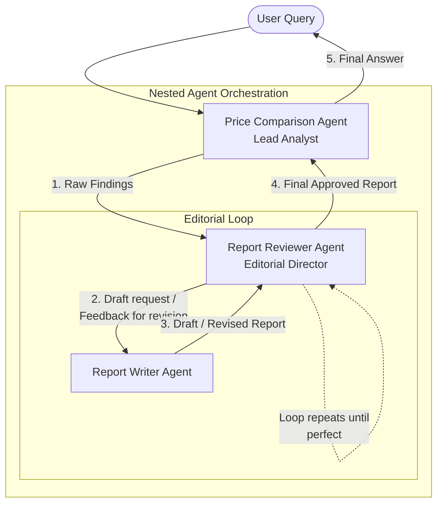

# Price Report Agentic Orchestration Plan

This plan details how to create an autonomous multi-agent system using Mastra's nested agent (Supervisor) pattern. Instead of using deterministic workflows, we will rely entirely on the reasoning capabilities of the agents to pass data, evaluate output, and self-correct.

## Architecture

The orchestration uses a nested hierarchy where agents act as sub-supervisors for specific tasks:

1.  **Price Comparison Agent** (The Lead Analyst):
    *   **Role**: Top-level orchestrator.
    *   **Action**: Interprets the user query, uses tools to search and gather pricing metrics, and passes the raw findings to the Reviewer Agent to get a finalized report. Once received, it presents it to the user.
    *   **Sub-Agents**: Has access to `Report Reviewer Agent`.

2.  **Report Reviewer Agent** (The Editorial Director):
    *   **Role**: Middle-level supervisor focused on quality control.
    *   **Action**: Takes raw findings from the Lead Analyst. It calls the Report Writer Agent to draft an initial report, evaluates it against validation criteria, and if issues are found, it autonomously calls the Writer Agent again with specific feedback for a revision.
    *   **Sub-Agents**: Has access to `Report Writer Agent`.

3.  **Report Writer Agent** (The Specialist):
    *   **Role**: Dedicated content formatter.
    *   **Action**: Takes data and feedback and formats it into the structured report exactly as instructed. It does not analyze or evaluate.

## Diagram

## Implementation Steps

*   **Update `reportWriterAgent`**: Ensure its `agents` array is empty and it remains a focused tool for writing text without internal reasoning loops about validation.
*   **Update `reportReviewerAgent`**:
    *   Import `reportWriterAgent`.
    *   Add `agents: [reportWriterAgent]` to its configuration.
    *   Update its system prompt so it knows how to use the Writer, review the output, and pass it back for corrections until it passes all checks.
*   **Update `pricingComparisonAgent`**:
    *   Import `reportReviewerAgent`.
    *   Add `agents: [reportReviewerAgent]` to its configuration.
    *   Update its system prompt so it focuses on executing tools for pricing calculations and delegating the reporting task to the Reviewer.